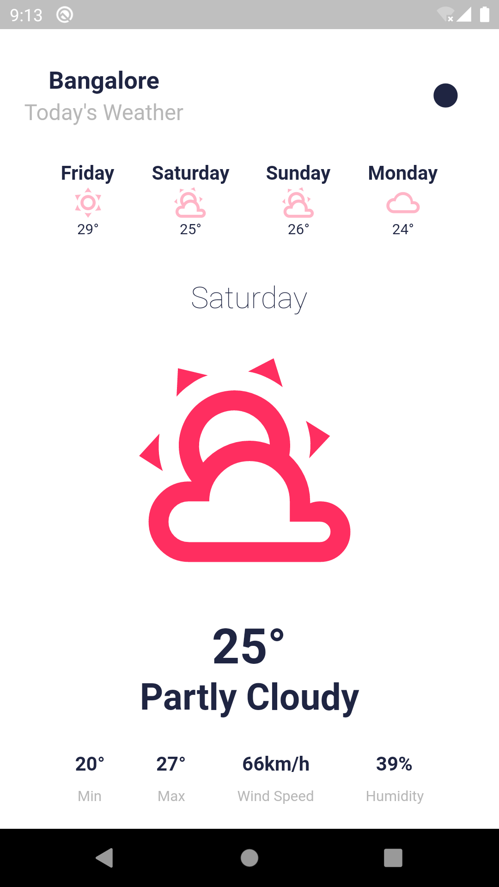
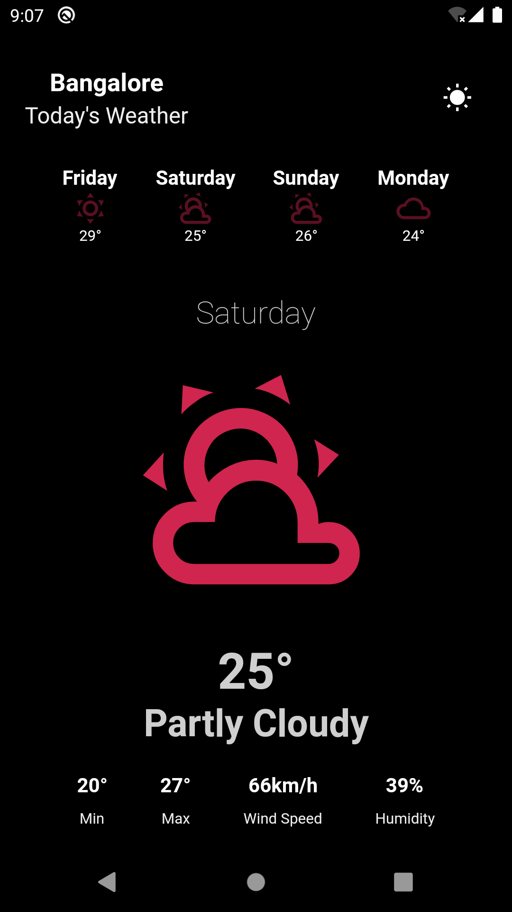

# Lazybit UI

I'll keep on updating this section.

## Getting Started

This project is created Just to design UI in flutter from many sources like dribbble, uplabs, reference from friends etc...

<b>Note</b>:
Credits goes to the one who designed these UI in Sketch, Adobe any using many various apps and provided this beautiful designs in platform like dribbble and uplabs.

## Screenshots

<b>Home</b>:

 
 

<b>Ecommerce</b>:

 
 

<b>Blog 1</b>:

 
 

<b>Blog 2</b>:

 
 

<b>Dashboard</b>:

 
 

<b>Workout</b>:

 
 

<b>Weather</b>:

